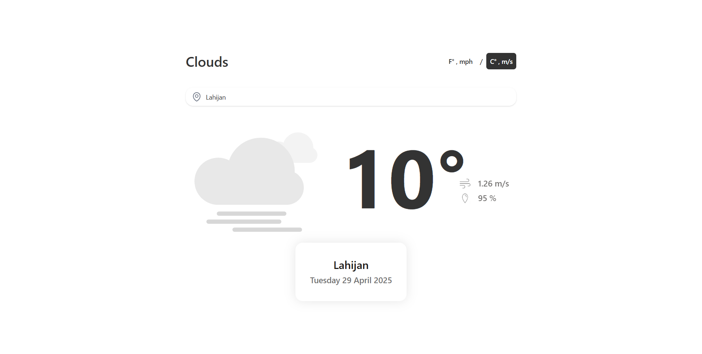

# Weatherly 🌦️

**Weatherly** is a simple single-page weather app built with **HTML**, **Vanilla JavaScript**, and **Tailwind CSS**.  
It fetches real-time weather data for any city using the **OpenWeatherMap API** and supports both metric and imperial units.

---

## 🌐 Live Demo

👉 [Click here to view the live site](https://mrezarp.github.io/Weatherly/)

---

## ✨ Features

- 🌍 Search any city and get live weather data
- 💨 Shows temperature, wind speed, and humidity
- 🔁 Switch between Metric (°C/m/s) and Imperial (°F/mph)
- 🎬 Animated weather icons using Lottie files
- ⚡ Smooth loading animation

---

## ⚙️ Tech Stack

- HTML5
- JavaScript (Vanilla)
- Tailwind CSS
- Axios (local)
- OpenWeatherMap API
- Lottie animations

---

## 🚀 How to Use

1. Clone the repo or [download the ZIP](https://github.com/mrezarp/weatherly)
2. Open `index.html` in your browser
3. Type a city name to get the current weather instantly!

---

## 🧠 Credits

- Weather data from [OpenWeatherMap](https://openweathermap.org/)
- Animated icons powered by [Lottie](https://lottiefiles.com/)

---

## ✍️ Author

Made with ❤️ by [@mrezarp](https://github.com/mrezarp)